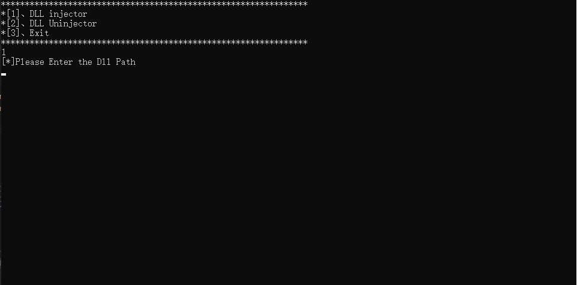
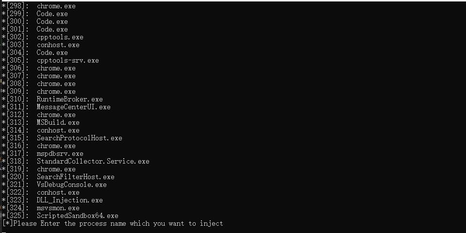
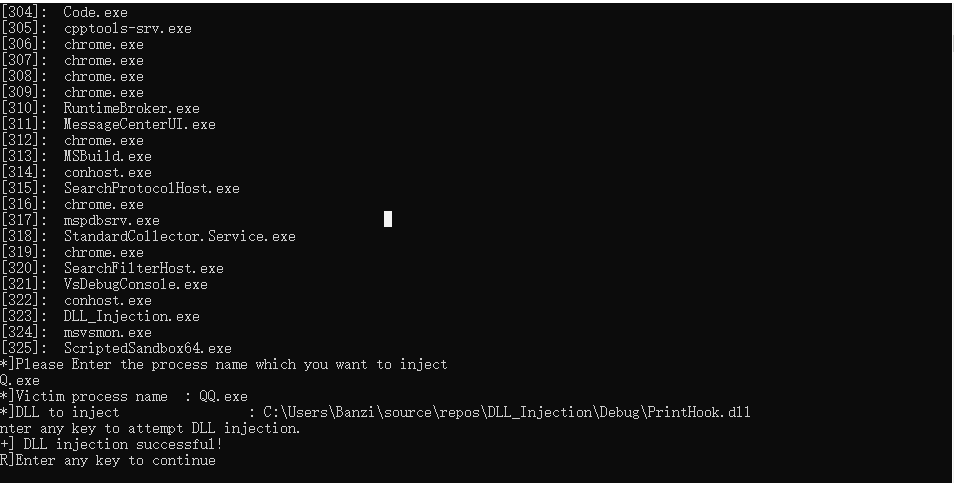

# DLL inject & uninject
## 1、Double click the 'DLL_Injection.exe'
### Select the function which you want to use
### 1、DLL inject
### 2、DLL uninject
### 3、Exit the program

#
# Introduction
## DLL inject
### First, you should enter the DLL path(absolute path)
### Second, enter the process name which you want to inject
### Third, Enter any key, inject DLL to the process

